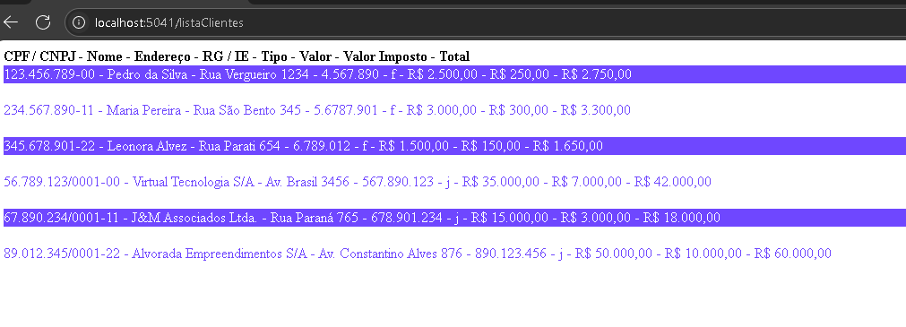

# Projeto LH-Pets

# 🚀 Projeto de Integração Web e Banco de Dados 📊

Este projeto consiste em uma **página web simples**, cujo objetivo principal é demonstrar a **integração da aplicação web com um banco de dados**. 🌐 A comunicação ocorre através da rota `/listaClientes`, que é responsável por buscar e exibir informações do banco de dados na página.

---

## 🎯 Objetivo

Esta atividade foi realizada como parte do **curso FullStack do Senai**, focando na prática de conexão e interação de uma interface web com um sistema de gerenciamento de banco de dados. Um passo essencial para se tornar um desenvolvedor completo! 💻✨

---

## 🖼️ Visualização do Projeto

Confira abaixo um print da nossa página web em funcionamento:

---
